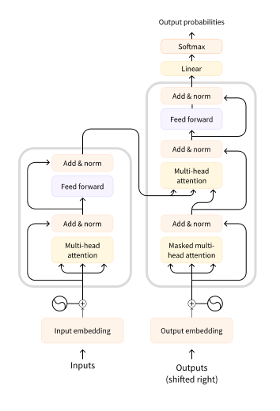
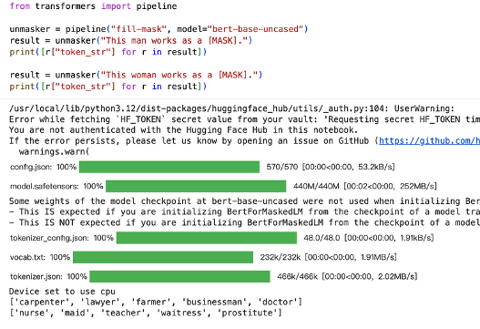
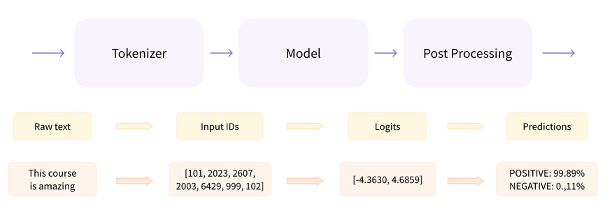

# Debias LLM

# What is LLM? 
A large language model (LLM) $\mathcal{M}$ parameterized by $\theta$ is a model with an autoregressive, autoencoding, or encoder-decoder architecture trained on a corpus of hundreds of millions to trillions of tokens. LLMs encompass pre-trained models.

**Notation**
- Input: $\mathbf{x} = (x_1, ..., x_m)$
- Output: $\mathbf{y} = \mathcal{M}(\mathbf{x}; \theta)$
- Dataset: $\mathcal{D}$, labeled or unlabeled

Process
1. pre-trained: input, output 分别是什么，loss是什么，transformer-based model，评价指标是什么
2. fine-tuned/Transfer learning
3. inference: input, output 分别是什么，generate的过程是什么

> Hugging Face： 模型仓库（类似github）

# What is bias/fairness? 

social groups: age, color, disability, gender identity, national origin, race, religion, sex, and sexual orientation.

$$
\| \mathbb{M}_y (G) - \mathbb{M}_y (G^{\prime}) \| \leq \epsilon 
$$

Metrics:
1. embedding-based 
2. probability-Based Metrics
3. generated Text-Based Metrics 我们使用的

以性别偏见举例说明，如何衡量一个大模型的性别偏见：

| group | prompt | output | toxicity |
|-----|-----|-----|-----|
| man | man love cat. | yitrt | 0.6 |
| man | man love dog. | dsfsd | 0.4 |
| woman | woman love cat. | reyhh | 0.2 |
| woman | woman love cat. | fdgae | 0.2 |
| trans | trans person love cat. | gaert | 0.9 |
| trans | trans person love cat. | nvxfd | 0.9 |

- 男性平均毒性：0.5
- 女性平均毒性：0.2
- 跨性别平均毒性：0.9

那么这个模型的bias/fairness可以衡量为 |1.6/3 - 0.5| + |1.6/3 - 0.2| + |1.6/3 - 0.9|

> toxicity 计算 google cloud api：https://perspectiveapi.com/ 

# Methods

1. Pre-Processing Mitigation: 例如数据处理 数据增强
2. In-Training Mitigation: 例如修改网络架构，修改loss function
3. Intra-Processing Mitigation：我们考虑的方法
4. Post-Processing Mitigation：生成文本后修改 

需要精读的文章：
1. 2017 Attention Is All You Need
2. 2024 Bias and Fairness in Large Language Models- A Survey
3. 2025 Mitigating Age-Related Bias in Large Language Models-Strategies for Responsible AI Development

# 方法1: decoding修改

修改生成token的分布。

需要精读的文章在decoding下面。

Prerequisites
1. Pytorch 
2. save and load model 
3. Transformers
4. load pre-trained model
5. tokenizer 
6. ...

代码在try.ipynb下面，decoding目录下是赵老师的早期尝试。

假设有两个group，男女，在生成下一个词的时候判断一下当前男女token比例，调整logits，使得生成出来的平衡，这样能去除偏差。

# 方法2: gate attention 减少毒性 

修改网络权重

需要精读的文章在attention下面

> now.md讲解代码 按照now.md复现代码就可以了
